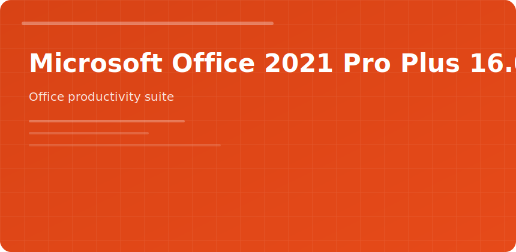

  

  

# Microsoft Office 2021 Pro Plus 16.0

 

One-time license bundle for orgs avoiding subscription accounting.

## Apps included

| App | Role |
|-----|------|
| Word | Documents, templates |
| Excel | Models, pivots |
| PowerPoint | Decks |
| Outlook | Mail/calendar |
| Access | Lightweight DB |
| Publisher | Marketing layouts |

## vs Microsoft 365

No ongoing feature drops; security updates still ship. Teams/OneDrive not bundled—plan separately.

## IT note

Standardize on 64-bit install; match proofing languages to locale packs at deploy time.

microsoft office 2021 pro plus word excel outlook perpetual
